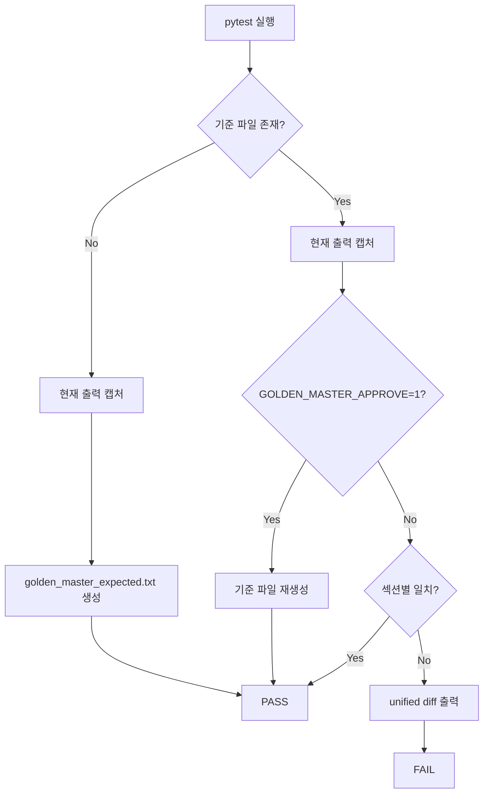

# Golden Master (Approval) Regression Design — Magic Square Solver

| 항목 | 내용 |
|------|------|
| 문서 버전 | 1.1 |
| 기준일 | 2026-05-29 |
| 대상 API | `MagicSquareBoundary.solve(grid)` |
| 테스트 프레임워크 | pytest |
| 기준 파일 | `tests/golden_master_expected.txt` |

---

## 1. 목적

Magic Square Solver의 **실제 Boundary 출력**을 기준선(Golden Master)으로 고정하여, 이후 구현 변경 시 회귀(regression)를 자동으로 탐지한다.

본 설계는 stdout CLI가 아닌 **Result DTO 직렬화** 방식을 사용한다.

| 결과 유형 | 직렬화 형식 |
|-----------|-------------|
| 성공 | `list[int]` 6원소 벡터 문자열 (예: `[1, 2, 3, 1, 4, 13]`) |
| 검증 실패 | `FailureResult.code` (예: `INVALID_EMPTY_COUNT`) |
| 해 불가 | `UnsolvableError.code` (예: `UNSOLVABLE`) |

---

## 2. 테스트 케이스 (GM-2)

| Test ID | Section Key | Fixture | 검증 대상 |
|---------|-------------|---------|-----------|
| GM-TC-01 | `normal_success` | `GRID_TD01` | int[6], row-major, 1-index, small-first |
| GM-TC-02 | `reverse_success` | `GRID_G1` | int[6], row-major, 1-index, reverse fallback |
| GM-TC-03 | `invalid_blank_count` | `GRID_THREE_BLANKS` | `INVALID_EMPTY_COUNT` Error Contract |
| GM-TC-04 | `duplicate_number` | `GRID_DUPLICATE` | `DUPLICATE_VALUE` Error Contract |
| GM-TC-05 | `no_valid_solution` | `GRID_G3` | `UNSOLVABLE` Error Contract |

---

## 3. 기준 파일 구조

섹션은 `[section_key]` 헤더로 구분하며, 섹션 간 구분선은 `________________________________________` 이다.

### 3.1 성공 케이스

```text
[normal_success]
Input:
16 0 2 0
5 10 11 8
9 6 7 12
4 15 14 1
Output:
[1, 2, 3, 1, 4, 13]
```

### 3.2 오류 케이스

```text
[invalid_blank_count]
Input:
16 3 2 13
5 0 11 8
9 0 0 12
4 15 14 1
Error:
INVALID_EMPTY_COUNT
```

---

## 4. Approve 패턴

### 4.1 동작 규칙

| 조건 | 동작 |
|------|------|
| 기준 파일 **없음** | 현재 Solver 출력으로 자동 생성 후 통과 |
| 기준 파일 **있음** | actual vs expected 섹션 단위 비교 |
| **불일치** | `difflib.unified_diff` 출력 후 `AssertionError` (FAIL) |
| `GOLDEN_MASTER_APPROVE=1` | 불일치 여부와 관계없이 기준 파일 재생성 |

### 4.2 흐름도



---

## 5. 구현 구성

| 구성요소 | 경로 | 역할 |
|----------|------|------|
| 헬퍼 | `tests/golden_master_helper.py` | 캡처, 직렬화, 파싱, contract 검증, diff, approve |
| 회귀 테스트 | `tests/boundary/test_golden_master_magic_square.py` | GM-TC-01~05, `@pytest.mark.golden_master` |
| 생성 스크립트 | `scripts/generate_golden_master.py` | 기준 파일 명시적 재생성 |
| 기준 파일 | `tests/golden_master_expected.txt` | 버전 관리 대상 SSOT |
| 실행 예시 | `docs/golden_master_execution_example.txt` | `pytest -m golden_master -v` 결과 |

---

## 6. 사용 방법

### 6.1 기준 파일 최초 생성 / 재생성

```powershell
python scripts/generate_golden_master.py
```

stdout만 확인:

```powershell
python scripts/generate_golden_master.py --stdout
```

### 6.2 회귀 테스트 실행

```powershell
python -m pytest -m golden_master -v
```

또는 파일 지정:

```powershell
python -m pytest tests/boundary/test_golden_master_magic_square.py -v
```

### 6.3 의도적 출력 변경 승인 (Approve)

Solver 출력 변경이 의도된 경우:

```powershell
$env:GOLDEN_MASTER_APPROVE = "1"
python -m pytest -m golden_master -v
git add tests/golden_master_expected.txt
```

---

## 7. 캡처 및 Contract 검증

### 7.1 캡처

1. **Arrange**: `tests/conftest.py`, `tests/boundary/conftest.py`의 공유 fixture grid 사용
2. **Act**: `MagicSquareBoundary().solve(grid)` 호출
3. **Assert/Capture**:
   - `list[int]` → `Output:` 블록
   - `FailureResult` → `Error:` 블록 (`code`만 기록)
   - `UnsolvableError` → `Error:` 블록 (`code`만 기록)

### 7.2 Contract 검증 (GM-TC-01/02)

| 규칙 | 검증 함수 |
|------|-----------|
| int[6] 출력 형식 | `validate_success_contract()` — `len == 6` |
| row-major 규칙 | `EmptyCellLocator.locate()` 좌표 일치 |
| 1-index 규칙 | `r,c ∈ {1..4}` |
| 작은 수 우선 (Attempt 1) | GM-TC-01: `(n1,n2) == (small,large)` |
| reverse fallback (Attempt 2) | GM-TC-02: `(n1,n2) == (large,small)` |

### 7.3 Error Contract (GM-TC-03~05)

`validate_error_contract()` — `code` + `message` 완전 일치 (`FailureResult` / `UnsolvableError`)

GUI stdout은 표현 계층이므로 Golden Master 대상에서 제외한다.

---

## 8. 실패 시 출력 형식

불일치 시 pytest failure에 unified diff가 포함된다:

```text
--- expected [GM-TC-01]
+++ actual [GM-TC-01]
@@ -6,4 +6,4 @@
 Output:
-[1, 2, 3, 1, 4, 13]
+[9, 9, 9, 9, 9, 9]
```

---

## 9. 유지보수 규칙

- 기준 파일은 **반드시 Git에 커밋**한다.
- 알고리즘/계약 변경 시 생성 스크립트 또는 `GOLDEN_MASTER_APPROVE=1`로 재생성 후 diff 리뷰한다.
- 새 시나리오 추가 시 `GOLDEN_SCENARIOS` 튜플, 생성 스크립트, 본 문서 §2를 함께 갱신한다.
